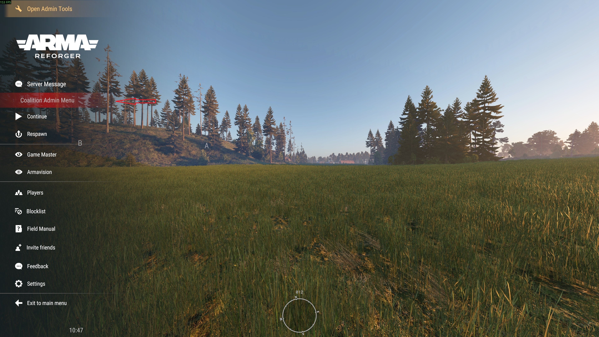

# Coalition Reforger Framework (CRF) - Admin Menu Usage Documentation

## Accessing CRF Admin Menu
- Your arma guid must be added to the server-side moderator config wherever the server(s) are hosted.

 

## Menu List 
- Tickets
  - Players may create tickets by using `/a <message>` in chat. This will create a ticket to easily respond to them in this tab.
   
- Gear Menu
  - The gear menu is used to reset individuals gear or add important items like radios, binos, or maps.
   
- Teleport Menu
  - Move people to others, you to them, or them to you.
   
- Heal menu
   
- Respawn menu
  - Respawning individual players or sides either on other players or at side flag poles
   
- Hint menu
  - Hint system ala arma3
   
- Gamemode menu
  - Allows admins to adjust time remaining in a mission, change loadouts via gearscript system for entire teams, and adjust respawn tickets.
   

## Point of Contact/SME:
its_dagger on Discord